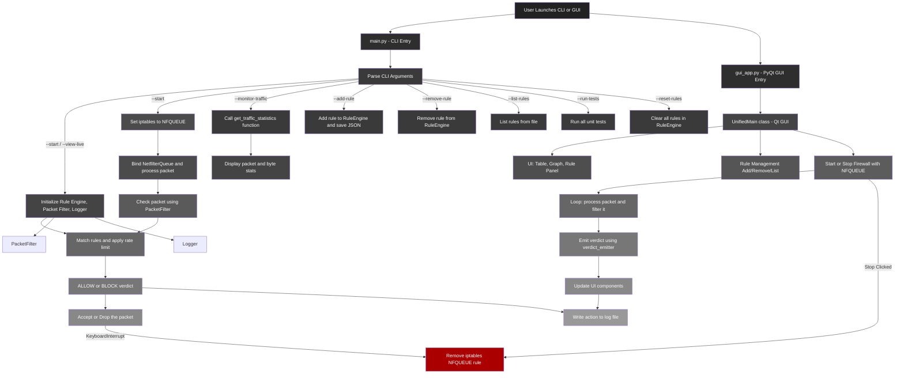
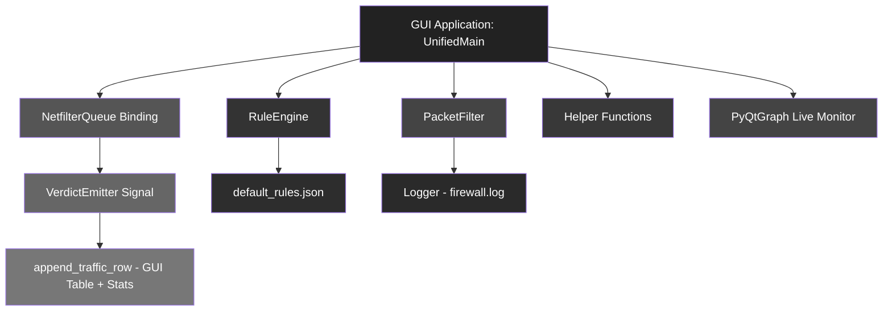

# KAVACH 

Kavach is a real-time packet filtering firewall written in Python using Scapy and NetfilterQueue. It provides both a command-line interface (CLI) and a modern graphical interface (GUI) built with PyQt5, allowing for dynamic rule management, live packet monitoring, and security logging.

---

  

## OVERVIEW

- Real-time firewall that hooks into Linux iptables using NetfilterQueue
- GUI and CLI interfaces supported
- Allows and blocks packets based on custom rule engine
- Tracks traffic statistics (total, allowed, blocked)
- Supports IP/subnet, port, and action-based rules
- Fully theme-customizable PyQt5 GUI
- Graph-based live traffic monitor using pyqtgraph
- Proper teardown of firewall hook even on GUI close

---

## RUNTIME ARCHITECTURE
### CLI & GUI
```mermaid
flowchart TD
    Start[User Launches CLI or GUI]

    %% Entry points
    Start --> CLI[CLI Entry: main.py]
    Start --> GUI[GUI Entry: gui_app.py]

    %% CLI Route
    CLI --> ArgParser[Parse CLI Arguments]
    ArgParser -->|--start / --view-live| InitFirewall[Initialize Rule Engine + Packet Filter + Logger]
    ArgParser -->|--start| NFQ[Set iptables → NFQUEUE]
    NFQ --> PacketRoute[Bind NetfilterQueue → process_packet()]
    PacketRoute --> PacketFilterCall[Check Packet with PacketFilter]
    PacketFilterCall --> RuleEngine[Match Rules + Check Rate Limit]
    RuleEngine --> Verdict[ALLOW / BLOCK]
    Verdict --> Action[accept() or drop()]
    Verdict --> Log[Log to File via Logger]

    %% Traffic Monitor
    ArgParser -->|--monitor-traffic| Monitor[get_traffic_statistics() from interface]
    Monitor --> DisplayStats[Show packets + bytes sent/received]

    %% CLI Rule Management
    ArgParser -->|--add-rule| AddRule[Add rule to RuleEngine + Save JSON]
    ArgParser -->|--remove-rule| RemoveRule[Remove rule from RuleEngine + Save]
    ArgParser -->|--list-rules| ListRules[Print Rules from JSON]

    %% CLI Exit or Exception
    ArgParser -->|--run-tests| RunTests[Run Unit Tests from test_firewall.py]
    ArgParser -->|--reset-rules| ResetRules[Clear all rule entries in RuleEngine]

    %% GUI Route
    GUI --> UnifiedMain[UnifiedMain Class (Qt UI)]
    UnifiedMain --> GUIComponents[Traffic Table + Graph + Rule Panel]
    UnifiedMain --> GUILogic[Add/Remove/List Rules through RuleEngine]
    UnifiedMain --> GUIButtons[Start/Stop Firewall → bind NFQUEUE]
    GUIButtons --> GUILoop[process(pkt) + filter_packet() + emit verdict]
    GUILoop --> VerdictEmitter[verdict_emitter emits packet info]
    VerdictEmitter --> GUIUpdate[Append verdicts to table + graph + counter]
    GUIUpdate --> Log

    %% Shared Blocks
    InitFirewall --> RuleEngine
    InitFirewall --> PacketFilter
    InitFirewall --> Logger

    %% Cleanup Paths
    Action -->|KeyboardInterrupt| Cleanup[Remove NFQUEUE from iptables]
    GUIButtons -->|Stop Clicked| Cleanup
```

### CLI


### GUI



## FEATURES

### CORE

- IP / Subnet-based rule enforcement
- Source port validation
- Packet verdicts emitted in real time to GUI
- Persistent rule store (`default_rules.json`)
- Log tracking to `logs/firewall.log`
- Modular components (`rule_engine`, `packet_filter`, `packet_sniffer`, `logger`, `verdict_log`, etc.)

### GUI (PyQt5)

- Rule Management (Add, Remove, List)
- Input fields for IP, Port, Action
- Live updating QTableWidget showing traffic
- Traffic counters: total, allowed, blocked
- Real-time line graph for traffic (allowed/blocked)
- Start/Stop Firewall buttons with status
- Output panel for logs and feedback
- CloseEvent safely unbinds NFQUEUE

### CLI

- CLI rule control using flags
- Start and stop NFQUEUE-based firewall
- Dynamic rule additions/removals
- Argument validation using helpers

---

## 🔧 Installation

First, clone the repository and navigate into the project directory:

```bash
git clone https://github.com/shirshxk/kavach.git
cd kavach
```

Then, run the setup script to automatically install all required dependencies and configure CLI aliases:

```bash
sudo python3 setup.py
```

> This script installs packages listed in `requirements.txt` and creates convenient aliases:  
> `kavach` for the CLI tool and `kavachgui` for the GUI version.

If the aliases do not take effect immediately, restart your terminal or run `source ~/.bashrc` (or `~/.zshrc` depending on your shell).

## 📦 Dependencies

These are installed automatically by the setup script, but for reference:

```
PyQt5
pyqtgraph
scapy
netfilterqueue
psutil
colorama
tqdm
```

## 🚀 Usage

### GUI Mode

```bash
kavachgui
```

Or if you want to run it manually:

```bash
cd gui
sudo ./gui_app.py
```

### CLI Mode

Start the firewall:

```bash
kavach --start
```

View traffic live (no blocking):

```bash
kavach --view-live
```

Add a rule:

```bash
kavach -a "192.168.1.5,BLOCK"
```

Remove a rule:

```bash
kavach -r "192.168.1.5,BLOCK"
```

List all rules:

```bash
kavach -l
```

Block ports:

```bash
kavach -p "22,80,443"
```

Monitor traffic for 10 seconds (default):

```bash
kavach -m
```

Reset all rules:

```bash
kavach -d
```

Run unit tests:

```bash
kavach -u
```

Check version:

```bash
kavach -i
```

## RULE FORMAT

JSON rule structure:

```json
{
    "src": "192.168.1.0/24",
    "sport": 22,
    "action": "BLOCK"
}
```

- `src`: IP or subnet (CIDR supported)
- `sport`: Source port (optional)
- `action`: ALLOW or BLOCK

---

## LOGGING

All packet verdicts (ALLOW/BLOCK) are logged to:

```
logs/firewall.log
```

Example:

```
[2025-07-13 13:45:02] BLOCK 192.168.1.10:443 -> 10.0.0.1:80 TCP
[2025-07-13 13:45:06] ALLOW 192.168.1.11:1234 -> 10.0.0.1:22 UDP
```

---

## CODE STRUCTURE

```
firewall/
├── main.py
├── setup.py
├── gui/
│   ├── gui_app.py
│   ├── state.py
│   ├── verdict_log.py
│   └── unified_main.py
├── src/
│   ├── core/
│   │   ├── configs/
│   │   │   └── default_rules.json
│   │   ├── packet_sniffer.py
│   │   ├── packet_filter.py
│   │   ├── rule_engine.py
│   │   └── logger.py
│   └── utils/
│       └── helpers.py
├── logs/
│   └── firewall.log
├── tests/
│   └── test_*.py
├── logo.png
└── requirements.txt
```

---

## LICENSE

This project is licensed for educational and research purposes only, developed under the ST5062CEM Programming and Algorithm 2 module (Softwarica College).

---

## CREDITS

Developed by Shirshak Shrestha for coursework submission, July 2025

Course: Programming & Algorithm 2  
Module Code: ST5062CEM  
Instructor: Suman Shrestha
