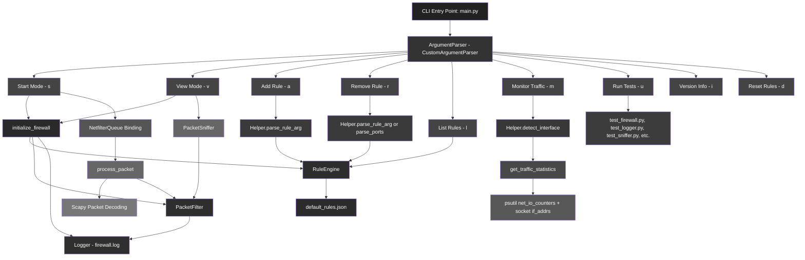
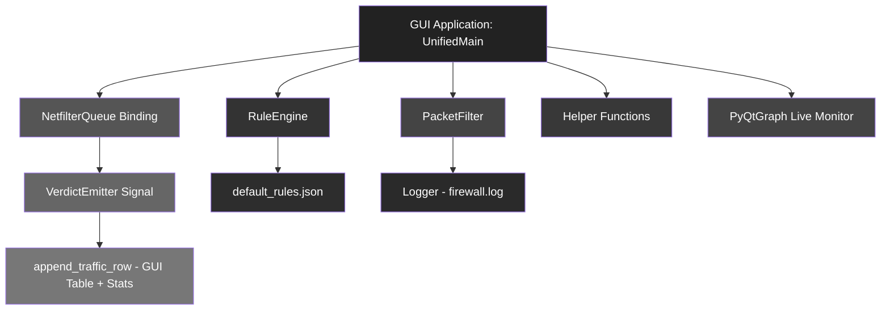

  

# KAVACH

  

KAVACH is a real-time packet filtering firewall written in Python using Scapy and NetfilterQueue. It provides both a command-line interface (CLI) and a modern graphical interface (GUI) built with PyQt5, allowing for dynamic rule management, live packet monitoring, and security logging.

  

---

  


  
  

## OVERVIEW

  

- Real-time firewall that hooks into Linux iptables using NetfilterQueue

- GUI and CLI interfaces supported

- Allows and blocks packets based on custom rule engine

- Tracks traffic statistics (total, allowed, blocked)

- Supports IP/subnet, port, and action-based rules

- Fully theme-customizable PyQt5 GUI

- Graph-based live traffic monitor using pyqtgraph

- Proper teardown of firewall hook even on GUI close

  

---

  

## RUNTIME ARCHITECTURE

  

### CLI



  

### GUI

  



  

## FEATURES

  

### CORE

  

- IP / Subnet-based rule enforcement

- Source port validation

- Packet verdicts emitted in real time to GUI

- Persistent rule store (`default_rules.json`)

- Log tracking to `logs/firewall.log`

- Modular components (`rule_engine`, `packet_filter`, `packet_sniffer`, `logger`, `verdict_log`, etc.)

  

### GUI (PyQt5)

  

- Rule Management (Add, Remove, List)

- Input fields for IP, Port, Action

- Live updating QTableWidget showing traffic

- Traffic counters: total, allowed, blocked

- Real-time line graph for traffic (allowed/blocked)

- Start/Stop Firewall buttons with status

- Output panel for logs and feedback

- CloseEvent safely unbinds NFQUEUE

  

### CLI

  

- CLI rule control using flags

- Start and stop NFQUEUE-based firewall

- Dynamic rule additions/removals

- Argument validation using helpers

  

---

  

## INSTALLATION

  

```bash

git  clone  https://github.com/shirshxk/kavach

cd  kavach

```

  

Install dependencies:

  

```bash

pip  install  -r  requirements.txt

```

  

`requirements.txt`:

  

```

PyQt5

pyqtgraph

scapy

netfilterqueue

psutil

```

  

---

  

## USAGE

  

### GUI

  

```bash

cd  gui

sudo  python3  gui_app.py

```

  

### CLI

  

```bash

sudo  python3  main.py  --start

```

  

To add rule:

  

```bash

python3  main.py  -a  "192.168.1.5,ALLOW"

```

  

To remove rule:

  

```bash

python3  main.py  -r  "192.168.1.5,ALLOW"

```

  

To list rules:

  

```bash

python3  main.py  -l

```

  

To stop firewall:

  

```bash

python3  main.py  --stop

```

  

---

  

## RULE FORMAT

  

JSON rule structure:

  

```json

{

"src": "192.168.1.0/24",

"sport": 22,

"action": "BLOCK"

}

```

  

-  `src`: IP or subnet (CIDR supported)

-  `sport`: Source port (optional)

-  `action`: ALLOW or BLOCK

  

---

  

## LOGGING

  

All packet verdicts (ALLOW/BLOCK) are logged to:

  

```

logs/firewall.log

```

  

Example:

  

```

[2025-07-13 13:45:02] BLOCK 192.168.1.10:443 -> 10.0.0.1:80 TCP

[2025-07-13 13:45:06] ALLOW 192.168.1.11:1234 -> 10.0.0.1:22 UDP

```

  

---

  

## CODE STRUCTURE

  

```

firewall/

├── cli/

│ └── main.py

├── gui/

│ ├── gui_app.py

│ └── unified_main.py

├── src/

│ ├── core/

│ │ ├── packet_sniffer.py

│ │ ├── packet_filter.py

│ │ ├── rule_engine.py

│ │ └── logger.py

│ └── utils/

│ └── helpers.py

├── logs/

│ └── firewall.log

├── default_rules.json

├── tests/

│ └── test_*.py

└── requirements.txt

```

  

---

  

## CLEAN EXIT STRATEGY

  

The GUI overrides `closeEvent()`:

  

```python

def  closeEvent(self, event):

if  hasattr(self, 'nfqueue'):

self.nfqueue.unbind()

subprocess.call(["sudo", "iptables", "-D", "INPUT", "-j", "NFQUEUE", "--queue-num", "1"])

event.accept()

```

  

This ensures that iptables rule is removed and firewall no longer blocks packets on unexpected closure.

  

---

  

## LICENSE

  

This project is licensed for educational and research purposes only, developed under the ST5062CEM Programming and Algorithm 2 module (Softwarica College).

  

---

  

## CREDITS

  

Developed by Shirshak Shrestha for coursework submission — July 2025

  

Course: Programming & Algorithm 2

Module Code: ST5062CEM

Instructor: Suman Shrestha